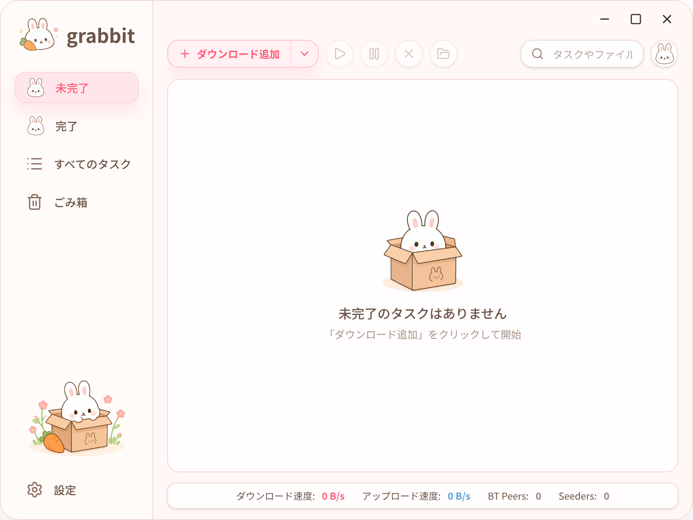

# Grabbit

<p align="center">
  
</p>

<p align="center">
  <strong>aria2 を利用したクロスプラットフォームのダウンロードマネージャー</strong><br />
  美しく、使いやすく、高機能です。
</p>

<p align="center">
  <a href="./README.md">English</a> | <a href="./README.zh.md">简体中文</a> | <a href="./README.ja.md">日本語</a>
</p>

<p align="center">
  
  
  
  
  
  
  
</p>

## 機能

<p align="center">
  
</p>

- HTTP、HTTPS、FTP、BitTorrent、Magnet、`.torrent`、Metalink のダウンロードに対応
- リンクの直接追加、`.torrent`/Metalink ファイルの取り込み、システムからの関連ファイルと `grabbit:?payload=...` リンクの起動に対応
- Torrent メタデータをプレビューし、ダウンロード前に個別ファイルを選択可能
- 一時停止、再開、削除、ダウンロード結果のクリアに対応し、進捗と速度をリアルタイムに表示
- ダウンロード中、完了、すべて、削除済みの各ビューでタスクを整理
- ダウンロード先、全体のダウンロード/アップロード速度制限、テーマ、言語を設定可能
- ライト/ダークテーマと、English、简体中文、日本語に対応
- BitTorrent tracker を自動更新し、UPnP/NAT-PMP/PCP のポートマッピングに対応
- ダウンロード完了時にデスクトップ通知を表示

## ブラウザー拡張機能

Grabbit には、リンクをコピーしてアプリを開き、貼り付ける手間を減らし、ダウンロードの成功率を高めるためのブラウザー拡張機能があります。

拡張機能をインストールすると、設定は不要です。ブラウザーでダウンロードが開始されるたびに、自動的に Grabbit に送信されます。

次のような場面で便利です。

- 何度もリンクをコピーしたくない場合。
- URL だけでなく、Cookie などのリクエスト情報も必要なダウンロードの場合。

Grabbit の拡張機能がこれらを自動的に処理します。

## 対応プラットフォーム

現在のパッケージ設定には、次のプラットフォームとアーキテクチャが含まれています。

- Linux x64
- Linux arm64
- macOS arm64
- Windows x64

## ダウンロードとインストール

インストーラーは [GitHub Releases](https://github.com/ricode-labs/grabbit/releases) ページで公開されています。お使いのシステムに合ったファイルをダウンロードしてください。

- Linux x64: `Grabbit-linux-x64.flatpak`
- Linux arm64: `Grabbit-linux-arm64.flatpak`
- macOS arm64: `Grabbit-macos-arm64.pkg`
- Windows x64: `Grabbit-windows-x64-setup.exe`

### Linux

先に Flatpak をインストールしてから、`.flatpak` ファイルをダブルクリックするか、ターミナルで次を実行します。

```bash
flatpak install --user ./Grabbit-linux-x64.flatpak
```

### Windows

`Grabbit-windows-x64-setup.exe` をダウンロードして実行し、インストーラーの案内に従ってインストールします。

### macOS

macOS インストーラーは現在 Apple による署名と公証を受けていないため、開発元を確認できないという警告が表示される場合があります。初回インストール時は次の手順に従ってください。

1. `Grabbit-macos-arm64.pkg` をダウンロードし、ダブルクリックしてインストーラーを起動します。
2. macOS がインストーラーをブロックした場合は、「完了」をクリックするか警告を閉じます。
3. 「システム設定」->「プライバシーとセキュリティ」を開きます。
4. 「セキュリティ」セクションで Grabbit がブロックされたというメッセージを見つけ、「このまま開く」をクリックします。
5. 表示に従ってパスワードを入力するか Touch ID で確認し、`.pkg` インストーラーをもう一度開きます。
6. インストールウィザードに従ってインストールを完了します。

Finder でインストーラーまたは Grabbit を Control キーを押しながらクリックし、「開く」を選択して、確認ダイアログでも「開く」をクリックする方法もあります。

## License

MIT
