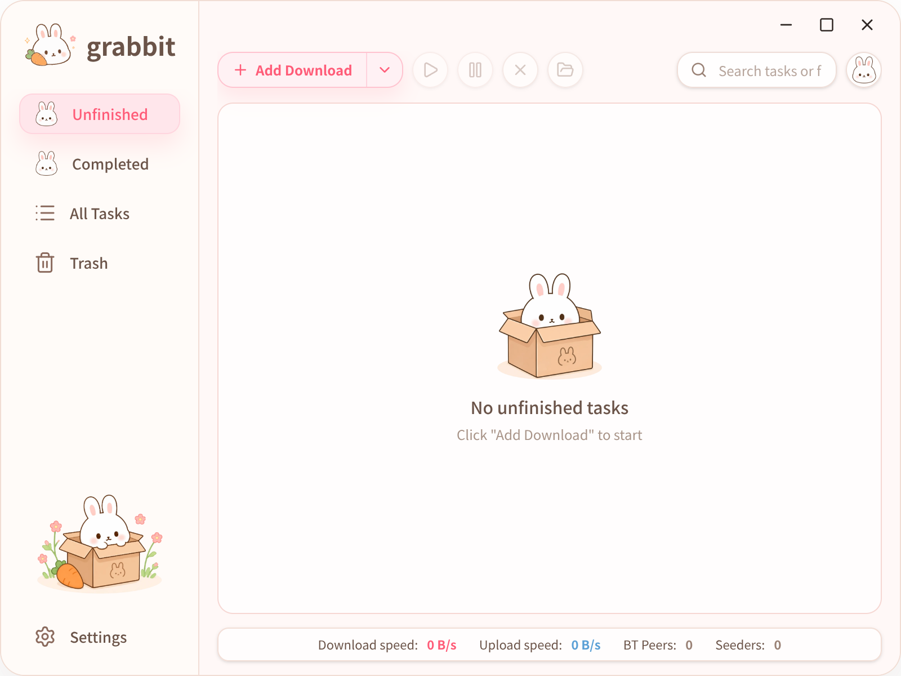

# Grabbit

<p align="center">
  
</p>

<p align="center">
  <strong>A cross-platform download manager powered by aria2</strong><br />
  Beautiful, easy to use, and powerful.
</p>

<p align="center">
  <a href="./README.md">English</a> | <a href="./README.zh.md">简体中文</a> | <a href="./README.ja.md">日本語</a>
</p>

<p align="center">
  
  
  
  
  
  
  
</p>

## Features

<p align="center">
  
</p>

- Download from HTTP, HTTPS, FTP, BitTorrent, Magnet, `.torrent`, and Metalink sources
- Add links directly, import `.torrent`/Metalink files, or open supported files and `grabbit://` links from the system
- Preview torrent metadata and choose individual files before starting a download
- Pause, resume, remove, and clear download results, with live progress and speed stats
- Keep tasks organized by status, including active, completed, all, and deleted views
- Configure the download directory, global download/upload speed limits, theme, and language
- Supports light and dark themes, plus English, Simplified Chinese, and Japanese
- Automatically updates BitTorrent trackers and supports UPnP/NAT-PMP/PCP port mapping
- Shows desktop notifications when downloads complete

## Browser Extension

Grabbit provides a companion browser extension to reduce the steps of copying a link, opening the app, and pasting the link, while also improving download success rates.

After installation, no configuration is required. Whenever the browser starts a download, it is automatically sent to Grabbit without any manual action.

It is useful when:

- You do not want to copy links repeatedly.
- A download needs more than just the URL, such as cookies or other request information.

The Grabbit extension handles this automatically.

## Supported Platforms

The current packaging configuration includes these platforms and architectures:

- Linux x64
- Linux arm64
- macOS arm64
- Windows x64

## Download And Install

Installers are published on the [GitHub Releases](https://github.com/ricode-labs/grabbit/releases) page. Download the file that matches your system:

- Linux x64: `Grabbit-linux-x64.flatpak`
- Linux arm64: `Grabbit-linux-arm64.flatpak`
- macOS arm64: `Grabbit-macos-arm64.pkg`
- Windows x64: `Grabbit-windows-x64-setup.exe`

### Linux

Install Flatpak first, then double-click the `.flatpak` file, or run:

```bash
flatpak install --user ./Grabbit-linux-x64.flatpak
```

### Windows

Download and run `Grabbit-windows-x64-setup.exe`, then follow the installer prompts.

### macOS

The macOS installer is currently not signed or notarized by Apple, so macOS may show a warning that it cannot verify the developer. For the first installation, follow these steps:

1. Download `Grabbit-macos-arm64.pkg` and double-click it to run the installer.
2. If macOS blocks the installer, click "Done" or close the warning.
3. Open "System Settings" -> "Privacy & Security".
4. In the "Security" section, find the message saying Grabbit was blocked and click "Open Anyway".
5. Enter your password or use Touch ID when prompted, then open the `.pkg` installer again.
6. Follow the installer wizard to complete installation.

You can also Control-click the installer or Grabbit in Finder, choose "Open", then click "Open" in the confirmation dialog.

## License

MIT
